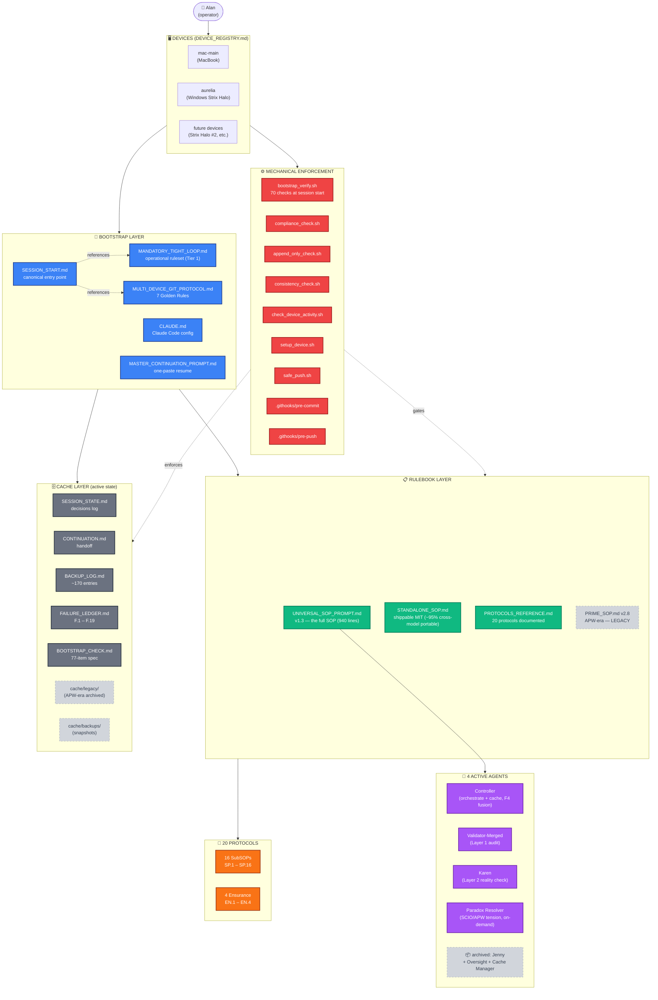
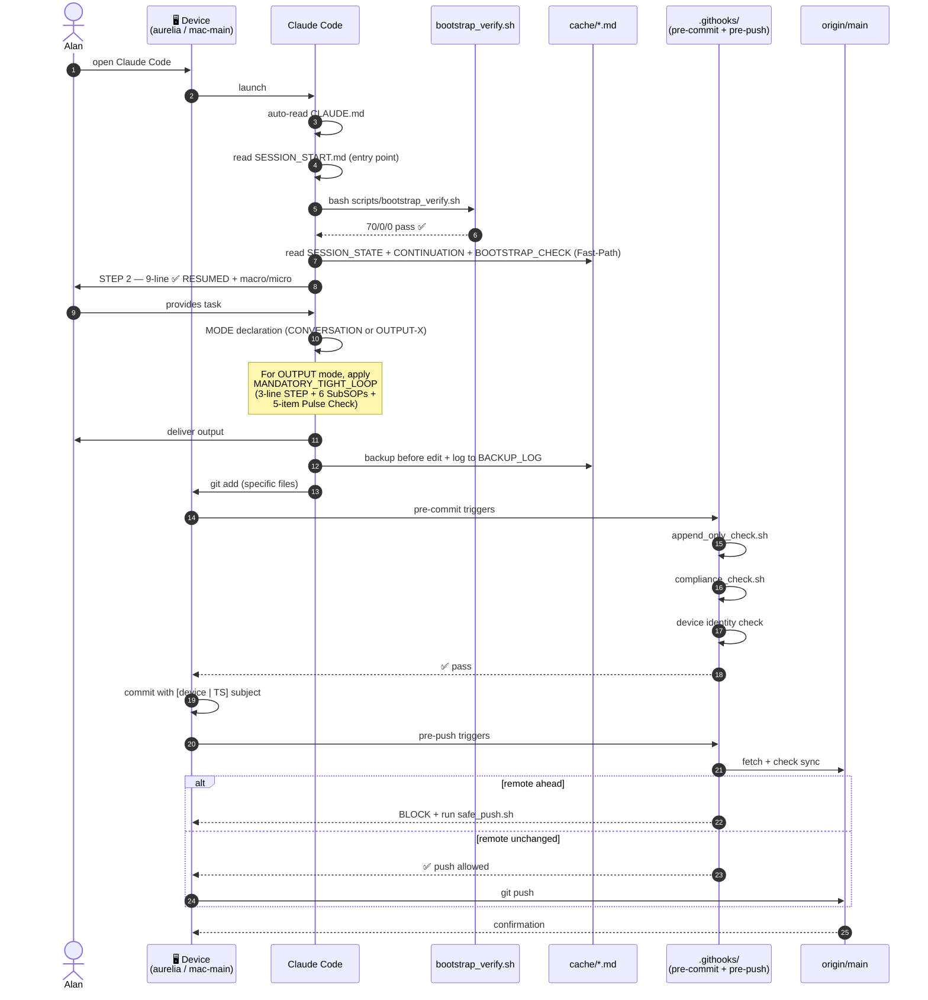
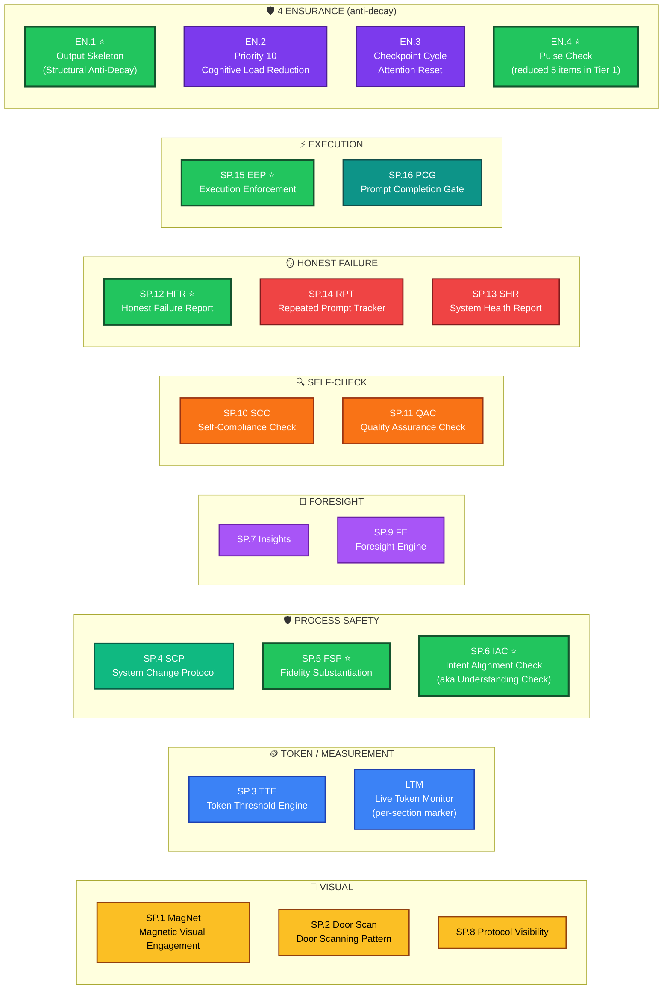
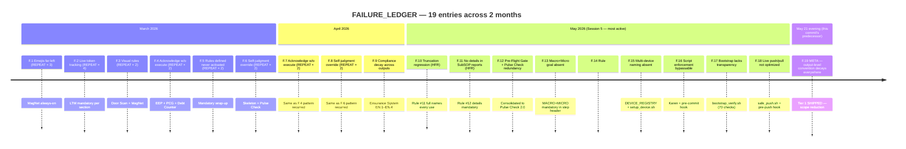

# 🗺️ SOP MAP — Visual Reference For The Entire System
# VERSION: 1.0 | 2026-05-21 | aurelia | Per Alan: "visualize the entire SOP in a very easy to understand way"
# Renders in any Mermaid-aware viewer: Obsidian, GitHub web, VSCode preview, IntelliJ, etc.

---

## 🎯 ONE-LINE OVERVIEW

> **The Universal SOP is a 6-layer system: Devices → Bootstrap → Rulebook → Protocols → Agents → Cache, gated by Mechanical Enforcement (scripts + hooks).** The full SOP defines 20 protocols (16 SubSOPs + 4 Ensurance) but per F.19 / `MANDATORY_TIGHT_LOOP.md` (Tier 1 fix, 2026-05-21), only 6+1 are mandatory for operational use. The rest stay reference-only in `PROTOCOLS_REFERENCE.md`.

---

## 🗺️ Diagram 1 — The Full System Map (6 layers + enforcement)

**Color legend:** 🔵 Bootstrap · 🟢 Rulebook · 🟠 Protocols · 🟣 Agents · ⚫ Cache · 🔴 Enforcement · ⚪ Legacy/archived

---

## 🔄 Diagram 2 — Session Lifecycle

How a normal session flows from open-Claude-Code to push-to-remote, including every hook + gate:

---

## 🧩 Diagram 3 — All 20 Protocols Grouped By Function

Functional grouping of the 16 SubSOPs + 4 Ensurance. **⭐ = part of the 6+1 MANDATORY TIGHT LOOP** (Tier 1 of F.19 fix — the rules that survive in real sessions). The other 13 are reference-only.

**The 7 mandatory tight-loop protocols** (green border):
- SP.5 FSP — every claim has evidence
- SP.6 IAC — Understanding Check before execution
- SP.12 HFR — honest root-cause when something fails
- SP.15 EEP — execute, don't acknowledge
- EN.1 Output Skeleton — mandatory sections always visible
- EN.4 Pulse Check (5 items) — pre-send mechanical sweep

---

## 🧠 Diagram 4 — The F.19 Insight: Discipline vs Architecture

Why some rules survive and others decay. The single deepest insight in the project's history:

```mermaid
flowchart LR
    classDef fail fill:#FEE2E2,color:#7F1D1D,stroke:#DC2626,stroke-width:2px
    classDef pass fill:#D1FAE5,color:#065F46,stroke:#10B981,stroke-width:2px
    classDef bridge fill:#FEF3C7,color:#92400E,stroke:#F59E0B,stroke-width:2px,stroke-dasharray:5 5

    subgraph DISC["❌ DISCIPLINE — decays<br/>(rules without gates, ~0% compliance)"]
        D1[STEP headers]
        D2[Understanding Check]
        D3[LTM per section]
        D4[Step Tracking Table]
        D5[Pulse Check 17 items]
        D6[Agent invocation]
        D7[Session-start ritual]
    end

    subgraph ARCH["✅ ARCHITECTURE — holds<br/>(rules with gates, ~85% compliance)"]
        A1[backups before edit]
        A2[device IDs in filenames]
        A3[append-only enforcement]
        A4[commit msg convention]
        A5[no deletion]
        A6[pre-commit hook]
        A7[pre-push hook]
        A8[bootstrap_verify.sh]
    end

    subgraph FIX["🛠️ TIERED FIX (F.19)"]
        T1["TIER 1 ✅ SHIPPED<br/>Scope reduction<br/>17→5, 16→6, 8→3"]
        T2["TIER 2 ⏳ STAGED<br/>Mode declaration<br/>(CONVERSATION vs OUTPUT-X)"]
        T3["TIER 3 ⏳ STAGED<br/>Outputs are files<br/>(pre-commit gates compliance)"]
    end

    DISC -->|"loses to<br/>immediate task"| Failed[F.1–F.19<br/>keep recurring]
    ARCH -->|"gated by hooks"| Success[holds across sessions<br/>+ devices]
    DISC -.->|T1 reduces surface| FIX
    DISC -.->|T2 scopes when SOP fires| FIX
    DISC -.->|T3 converts to architecture| ARCH

    class D1,D2,D3,D4,D5,D6,D7 fail
    class A1,A2,A3,A4,A5,A6,A7,A8 pass
    class T1,T2,T3 bridge
    class Failed fail
    class Success pass
```

See `SELF_COMPLIANCE_FIX.md` for the full diagnosis + acceptance tests.

---

## 📅 Diagram 5 — Failure Ledger Timeline (F.1 → F.19)

**Pattern visible in the timeline:** the most recent failures (F.14 onward) all got **mechanical** fixes (scripts, hooks, verifiers). The earlier failures (F.1–F.9) got **conventional** fixes (more rules), most of which re-failed and required a second pass. F.19 is the meta-insight: this IS the pattern, and the fix is to convert discipline to architecture.

---

## 📂 Diagram 6 — File Structure (repo at a glance)

```mermaid
flowchart TD
    classDef gov fill:#3B82F6,color:white,stroke:#1E40AF
    classDef rule fill:#10B981,color:white,stroke:#065F46
    classDef new fill:#F59E0B,color:white,stroke:#92400E,stroke-width:3px
    classDef cache fill:#6B7280,color:white,stroke:#1F2937
    classDef enf fill:#EF4444,color:white,stroke:#991B1B
    classDef arch fill:#D1D5DB,color:#374151,stroke:#9CA3AF

    Root["📦 universal-sop/"]
    Root --> Gov["governance docs (root)"]
    Root --> Cache["cache/"]
    Root --> Scripts["scripts/"]
    Root --> Hooks[".githooks/"]
    Root --> Agents["agents/"]
    Root --> Backups["backups/"]
    Root --> ChatA["chat_archive/"]
    Root --> Source["source_files/"]

    Gov --> g1["README.md<br/>SESSION_START.md<br/>CLAUDE.md"]
    Gov --> g2["UNIVERSAL_SOP_PROMPT.md<br/>STANDALONE_SOP.md<br/>PROTOCOLS_REFERENCE.md"]
    Gov --> g3["DEVICE_REGISTRY.md<br/>MULTI_DEVICE_GIT_PROTOCOL.md<br/>MASTER_CONTINUATION_PROMPT.md"]
    Gov --> g4["FAILURE_MODES_ANALYSIS.md<br/>TOKEN_OPTIMIZATION_GUIDE.md<br/>EFFICIENCY_GUIDE.md"]
    Gov --> g5["⭐ MANDATORY_TIGHT_LOOP.md<br/>⭐ SELF_COMPLIANCE_FIX.md<br/>⭐ SOP_MAP.md (THIS FILE)"]

    Cache --> c1["SESSION_STATE.md<br/>CONTINUATION.md<br/>BACKUP_LOG.md<br/>FAILURE_LEDGER.md<br/>BOOTSTRAP_CHECK.md"]
    Cache --> c2["legacy/<br/>(APW-era archived)"]
    Cache --> c3["backups/<br/>(historical snapshots)"]

    Scripts --> s1["bootstrap_verify.sh<br/>compliance_check.sh<br/>append_only_check.sh<br/>consistency_check.sh<br/>check_device_activity.sh<br/>setup_device.sh<br/>safe_push.sh"]

    Hooks --> h1["pre-commit<br/>pre-push"]

    Agents --> a1["controller.md<br/>validator-merged.md<br/>karen-reality-check.md<br/>paradox-resolver.md"]
    Agents --> a2["archive/<br/>jenny + oversight + cache-manager"]

    class g1,g3 gov
    class g2 rule
    class g5 new
    class c1 cache
    class c2,c3,a2 arch
    class s1,h1 enf
    class a1 gov
```

---

## 🎯 Quick Reference — What To Read When

| 🎯 Situation | 📄 Read |
|---|---|
| Fresh session, any device | `SESSION_START.md` → then `MANDATORY_TIGHT_LOOP.md` |
| New device first-time | `SESSION_START.md` + `DEVICE_REGISTRY.md` + run `scripts/setup_device.sh <name>` |
| Producing an output | `MANDATORY_TIGHT_LOOP.md` (3-line STEP + 6 SubSOPs + 5 Pulse Check) |
| Producing a publishable deliverable | `MANDATORY_TIGHT_LOOP.md` + full `UNIVERSAL_SOP_PROMPT.md` for the extras |
| Looking up a protocol by name | `PROTOCOLS_REFERENCE.md` |
| Investigating why something failed | `cache/FAILURE_LEDGER.md` (F.1 – F.19) |
| Understanding the F.19 insight | `SELF_COMPLIANCE_FIX.md` |
| Multi-device sync question | `MULTI_DEVICE_GIT_PROTOCOL.md` |
| Restoring a prior file state | `cache/BACKUP_LOG.md` → find the backup row → grab from `backups/` |
| External (non-Alan, non-Claude.ai) consumer | `STANDALONE_SOP.md` (MIT licensed, self-contained) |

---

## 🏷️ Glossary (read once, refer back)

| Term | Meaning |
|---|---|
| **SubSOP** | Sub-Standard-Operating-Procedure. 16 protocols SP.1 – SP.16 forming the rulebook's mechanics. |
| **Ensurance** | 4 anti-decay components EN.1 – EN.4 that prevent SubSOP compliance from eroding over a long session. |
| **Tight Loop** | The 6+1 protocols that MANDATORY_TIGHT_LOOP.md selects as mandatory for every operational OUTPUT (F.19 Tier 1 fix). |
| **Tier (in F.19 context)** | One of three architectural moves to fix the discipline-vs-architecture gap. Tier 1 shipped 2026-05-21; Tier 2 + Tier 3 staged. |
| **Tier (in SOP context)** | QUICK / STANDARD / COMPLEX — the rigor level of an output. Different from F.19 tiers. |
| **Pulse Check** | Pre-send mechanical sweep at the end of an output. Original: 17 items. Reduced (Tier 1): 5 items (P1–P5). |
| **HFR** | Honest Failure Report. When something failed, produce root cause + permanent fix in the same output. |
| **F.X** | Failure-Ledger entry X. Cumulative immutable log of every system failure + permanent fix. |
| **Mechanical enforcement** | Rule enforced by a script or hook, not by Claude self-discipline. (The ones that actually hold per F.19.) |
| **F4/F5/F8/etc. (fusion)** | Operations that merged multiple SOP components into one to reduce surface area. F4 merged Oversight + Cache Manager → Controller. F5 archived Jenny. F8 merged RPT_LOG + HFR → FAILURE_LEDGER. |

---

*Universal Output SOP v1.3 | SOP_MAP.md v1.0 | Visual reference for entire system | aurelia | 2026-05-21*
