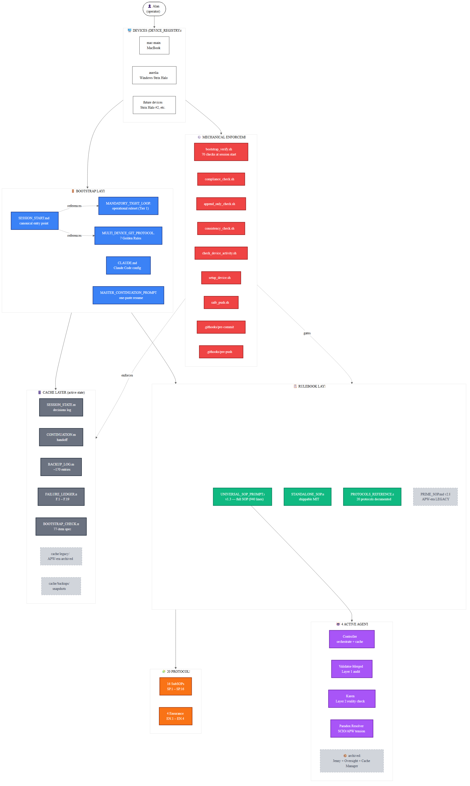
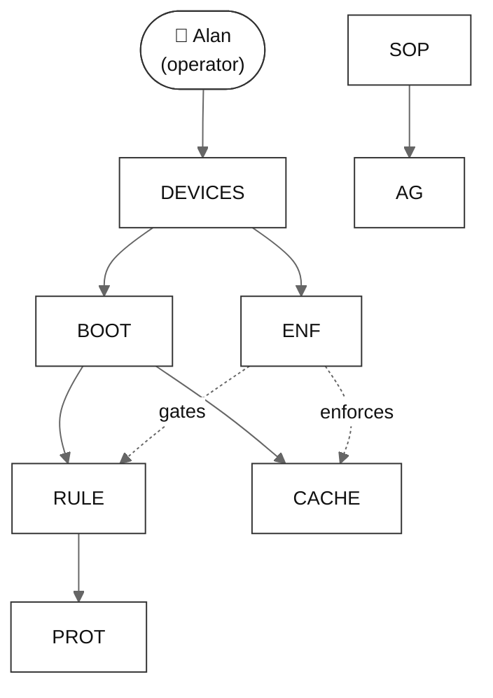
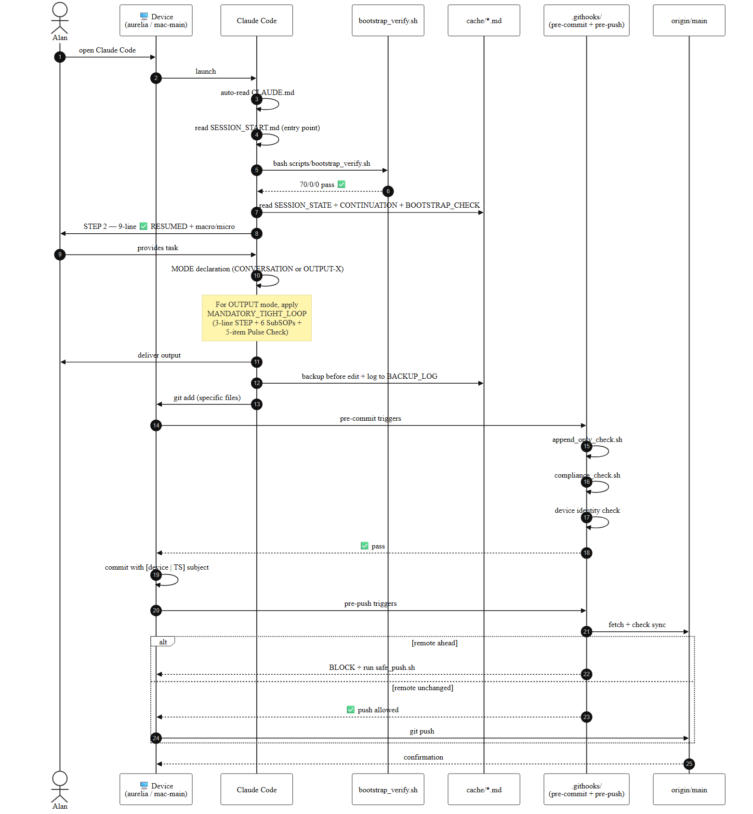
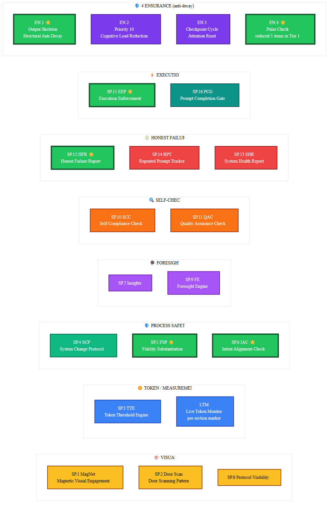
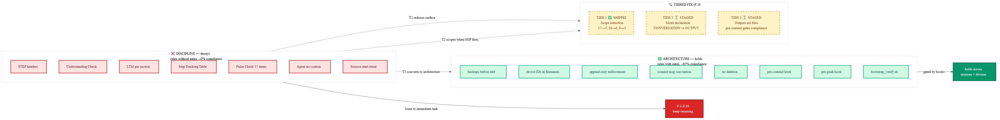
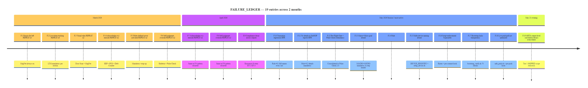
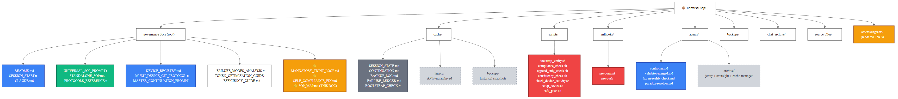

# 🗺️ SOP MAP — Visual Reference For The Entire System
# VERSION: 1.1 | 2026-05-21 | aurelia | Per Alan: "visualize... ACTUALLY... very easy to understand"
# v1.1 (2026-05-21 21:10 CDT): PNG images embedded inline + companion SOP_MAP.html for interactive view

---

## 👀 HOW TO VIEW

| 🎯 Viewing context | 📄 Best file |
|---|---|
| **Interactive in browser** (click to zoom, sticky TOC) | Open [`SOP_MAP.html`](./SOP_MAP.html) in any browser |
| **Markdown viewer that renders images** (Claude Code, most clients) | This file (`SOP_MAP.md`) — PNG images below |
| **Markdown viewer that renders Mermaid** (Obsidian, GitHub web, VSCode-with-extension) | This file (`SOP_MAP.md`) — collapsible Mermaid source below each image |
| **Re-render diagrams from scratch** | `diagrams_src/*.mmd` + `npx mmdc -i ...mmd -o ...png` |

---

## 🎯 ONE-LINE OVERVIEW

> **The Universal SOP is a 6-layer system: Devices → Bootstrap → Rulebook → Protocols → Agents → Cache, gated by Mechanical Enforcement (scripts + hooks).** The full SOP defines 20 protocols (16 SubSOPs + 4 Ensurance) but per F.19 / `MANDATORY_TIGHT_LOOP.md` (Tier 1 fix, 2026-05-21), only 6+1 are mandatory for operational use. The rest stay reference-only in `PROTOCOLS_REFERENCE.md`.

**Color legend:** 🔵 Bootstrap · 🟢 Rulebook · 🟠 Protocols · 🟣 Agents · ⚫ Cache · 🔴 Enforcement · ⚪ Legacy/archived

---

## 🗺️ Diagram 1 — The Full System Map (6 layers + enforcement)



Six color-coded layers (Bootstrap, Rulebook, Protocols, Agents, Cache, Enforcement) plus the Devices that operate on them. Every file, script, and hook is named.

<details>
<summary>📐 Mermaid source</summary>



Full Mermaid source: see `diagrams_src/01_system_map.mmd`.

</details>

---

## 🔄 Diagram 2 — Session Lifecycle (bootstrap → output → commit → push)



How a normal session flows from open-Claude-Code to push-to-remote, including every hook + gate.

<details>
<summary>📐 Mermaid source</summary>

See `diagrams_src/02_session_lifecycle.mmd` for the full source.

</details>

---

## 🧩 Diagram 3 — All 20 Protocols Grouped By Function



All 16 SubSOPs + 4 Ensurance organized by what they do. **⭐ = part of the 6+1 MANDATORY TIGHT LOOP** (Tier 1 of F.19 fix — the rules that survive in real sessions). The other 13 are reference-only.

**The 7 mandatory tight-loop protocols** (green border in diagram):
- **SP.5 FSP** — every claim has evidence
- **SP.6 IAC** — Understanding Check before execution
- **SP.12 HFR** — honest root-cause when something fails
- **SP.15 EEP** — execute, don't acknowledge
- **EN.1 Output Skeleton** — mandatory sections always visible
- **EN.4 Pulse Check** (5 items) — pre-send mechanical sweep

<details>
<summary>📐 Mermaid source</summary>

See `diagrams_src/03_protocols_grouped.mmd` for the full source.

</details>

---

## 🧠 Diagram 4 — The F.19 Insight: Discipline vs Architecture



The single deepest insight in the project's history. Discipline-style rules (red, left) achieve ~0% compliance in real sessions. Architectural rules (green, right) hold at ~85%. The 3-tier fix (yellow, middle) bridges the gap by converting discipline to architecture.

See `SELF_COMPLIANCE_FIX.md` for the full diagnosis + acceptance tests.

<details>
<summary>📐 Mermaid source</summary>

See `diagrams_src/04_discipline_vs_architecture.mmd` for the full source.

</details>

---

## 📅 Diagram 5 — Failure Ledger Timeline (F.1 → F.19)



**Pattern visible in the timeline:** the most recent failures (F.14 onward) all got **mechanical** fixes (scripts, hooks, verifiers). The earlier failures (F.1–F.9) got **conventional** fixes (more rules), most of which re-failed and required a second pass. F.19 is the meta-insight: this IS the pattern, and the fix is to convert discipline to architecture.

<details>
<summary>📐 Mermaid source</summary>

See `diagrams_src/05_failure_timeline.mmd` for the full source.

</details>

---

## 📂 Diagram 6 — File Structure (repo at a glance)



Where everything lives. Stars (⭐) mark the newest additions: `MANDATORY_TIGHT_LOOP.md`, `SELF_COMPLIANCE_FIX.md`, `SOP_MAP.md`, `SOP_MAP.html`.

<details>
<summary>📐 Mermaid source</summary>

See `diagrams_src/06_file_structure.mmd` for the full source.

</details>

---

## 🎯 Quick Reference — What To Read When

| 🎯 Situation | 📄 Read |
|---|---|
| Fresh session, any device | `SESSION_START.md` → then `MANDATORY_TIGHT_LOOP.md` |
| New device first-time | `SESSION_START.md` + `DEVICE_REGISTRY.md` + run `scripts/setup_device.sh <name>` |
| Producing an output | `MANDATORY_TIGHT_LOOP.md` (3-line STEP + 6 SubSOPs + 5 Pulse Check) |
| Producing a publishable deliverable | `MANDATORY_TIGHT_LOOP.md` + full `UNIVERSAL_SOP_PROMPT.md` for the extras |
| Looking up a protocol by name | `PROTOCOLS_REFERENCE.md` |
| Investigating why something failed | `cache/FAILURE_LEDGER.md` (F.1 – F.19) |
| Understanding the F.19 insight | `SELF_COMPLIANCE_FIX.md` |
| Multi-device sync question | `MULTI_DEVICE_GIT_PROTOCOL.md` |
| Restoring a prior file state | `cache/BACKUP_LOG.md` → find the backup row → grab from `backups/` |
| External (non-Alan, non-Claude.ai) consumer | `STANDALONE_SOP.md` (MIT licensed, self-contained) |

---

## 🏷️ Glossary (read once, refer back)

| Term | Meaning |
|---|---|
| **SubSOP** | Sub-Standard-Operating-Procedure. 16 protocols SP.1 – SP.16 forming the rulebook's mechanics. |
| **Ensurance** | 4 anti-decay components EN.1 – EN.4 that prevent SubSOP compliance from eroding over a long session. |
| **Tight Loop** | The 6+1 protocols that MANDATORY_TIGHT_LOOP.md selects as mandatory for every operational OUTPUT (F.19 Tier 1 fix). |
| **Tier (in F.19 context)** | One of three architectural moves to fix the discipline-vs-architecture gap. Tier 1 shipped 2026-05-21; Tier 2 + Tier 3 staged. |
| **Tier (in SOP context)** | QUICK / STANDARD / COMPLEX — the rigor level of an output. Different from F.19 tiers. |
| **Pulse Check** | Pre-send mechanical sweep at the end of an output. Original: 17 items. Reduced (Tier 1): 5 items (P1–P5). |
| **HFR** | Honest Failure Report. When something failed, produce root cause + permanent fix in the same output. |
| **F.X** | Failure-Ledger entry X. Cumulative immutable log of every system failure + permanent fix. |
| **Mechanical enforcement** | Rule enforced by a script or hook, not by Claude self-discipline. (The ones that actually hold per F.19.) |
| **F4/F5/F8/etc. (fusion)** | Operations that merged multiple SOP components into one to reduce surface area. F4 merged Oversight + Cache Manager → Controller. F5 archived Jenny. F8 merged RPT_LOG + HFR → FAILURE_LEDGER. |

---

## 🔧 Regenerate diagrams from source

```bash
# Render one
npx -y -p @mermaid-js/mermaid-cli mmdc -i diagrams_src/01_system_map.mmd -o assets/diagrams/01_system_map.png -w 3840 -b white

# Render all 6
for n in 01_system_map 02_session_lifecycle 03_protocols_grouped 04_discipline_vs_architecture 05_failure_timeline 06_file_structure; do
  npx -y -p @mermaid-js/mermaid-cli mmdc -i "diagrams_src/${n}.mmd" -o "assets/diagrams/${n}.png" -w 3840 -b white
done
```

---

*Universal Output SOP v1.3 | SOP_MAP.md v1.1 | Visual reference (PNG-embedded) + companion SOP_MAP.html | aurelia | 2026-05-21*
